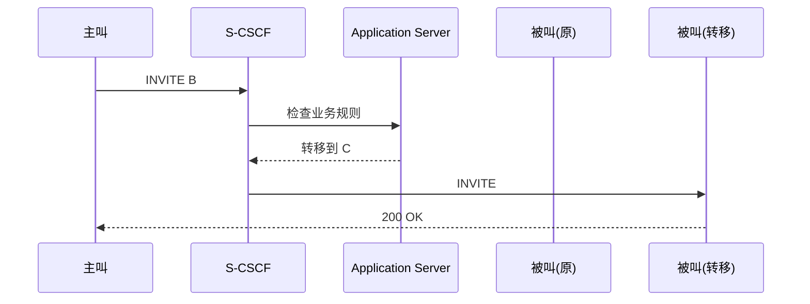
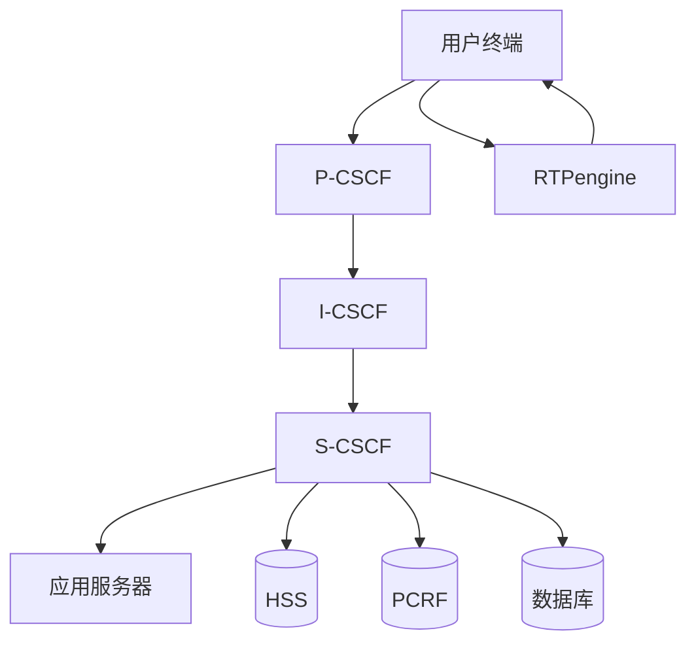

````md

## 📌 1. IMS 基本概念

IMS（IP Multimedia Subsystem）是运营商用于提供语音、视频、消息等多媒体通信服务的核心架构。

核心特点：
- 基于 SIP 协议
- 控制层与媒体层分离
- 高可用、可扩展

---

## 🧠 2. Kamailio 在 IMS 中的角色

Kamailio 是一个高性能 SIP 服务器，在 IMS 中主要实现 CSCF 功能：

- 信令处理（SIP）
- 路由控制
- 用户注册管理

👉 Kamailio = IMS 的“信令控制核心”

---

## 🧩 3. CSCF 模块划分

### 3.1 P-CSCF（入口代理）
- 用户接入点
- 处理 REGISTER / INVITE
- NAT 穿透、TLS/IPSec
- 转发信令

👉 类比：网关 / 门口代理

---

### 3.2 I-CSCF（查询节点）
- 查询用户归属（HSS）
- 路由到正确 S-CSCF
- 隐藏网络拓扑

👉 类比：调度中心

---

### 3.3 S-CSCF（核心控制）
- 用户注册处理
- SIP 会话控制
- 触发业务逻辑（AS）

👉 类比：核心大脑

---

## 🔄 4. 注册流程

```mermaid
sequenceDiagram
    participant UE
    participant P as P-CSCF
    participant S as S-CSCF
    participant H as HSS

    UE->>P: REGISTER
    P->>S: REGISTER
    S->>H: 鉴权请求
    H-->>S: 返回认证数据
    S->>S: 保存注册信息
    S-->>UE: 200 OK
````

### 关键点：

* P-CSCF：接收并转发
* S-CSCF：真正处理注册
* HSS：提供认证信息

---

## 📞 5. 呼叫流程（完整信令）

```mermaid
sequenceDiagram
    participant UE_A as 主叫 UE
    participant P_A as P-CSCF(A)
    participant I as I-CSCF
    participant S_A as S-CSCF(A)
    participant S_B as S-CSCF(B)
    participant P_B as P-CSCF(B)
    participant UE_B as 被叫 UE
    participant HSS

    %% ===== 注册（简化）=====
    UE_A->>P_A: REGISTER
    P_A->>I: REGISTER
    I->>HSS: 查询归属
    HSS-->>I: 返回 S-CSCF
    I->>S_A: REGISTER
    S_A->>HSS: 鉴权
    HSS-->>S_A: OK
    S_A-->>UE_A: 200 OK

    %% ===== 呼叫建立 =====
    UE_A->>P_A: INVITE
    P_A->>S_A: INVITE

    S_A->>HSS: 查询被叫路由
    HSS-->>S_A: 返回 S_B

    S_A->>S_B: INVITE
    S_B->>P_B: INVITE
    P_B->>UE_B: INVITE

    %% ===== 被叫振铃 =====
    UE_B-->>P_B: 100 Trying
    P_B-->>S_B: 100 Trying
    S_B-->>S_A: 100 Trying
    S_A-->>P_A: 100 Trying
    P_A-->>UE_A: 100 Trying

    UE_B-->>P_B: 180 Ringing
    P_B-->>S_B: 180 Ringing
    S_B-->>S_A: 180 Ringing
    S_A-->>P_A: 180 Ringing
    P_A-->>UE_A: 180 Ringing

    %% 可选早期媒体
    UE_B-->>P_B: 183 Session Progress
    P_B-->>S_B: 183 Session Progress
    S_B-->>S_A: 183 Session Progress
    S_A-->>P_A: 183 Session Progress
    P_A-->>UE_A: 183 Session Progress

    %% ===== 接听 =====
    UE_B-->>P_B: 200 OK
    P_B-->>S_B: 200 OK
    S_B-->>S_A: 200 OK
    S_A-->>P_A: 200 OK
    P_A-->>UE_A: 200 OK

    %% ACK 确认
    UE_A->>P_A: ACK
    P_A->>S_A: ACK
    S_A->>S_B: ACK
    S_B->>P_B: ACK
    P_B->>UE_B: ACK

    %% ===== 通话结束 =====
    UE_A->>P_A: BYE
    P_A->>S_A: BYE
    S_A->>S_B: BYE
    S_B->>P_B: BYE
    P_B->>UE_B: BYE

    UE_B-->>P_B: 200 OK
    P_B-->>S_B: 200 OK
    S_B-->>S_A: 200 OK
    S_A-->>P_A: 200 OK
    P_A-->>UE_A: 200 OK
```

### 关键 SIP 信令：

* `INVITE`：发起呼叫
* `180 Ringing`：响铃
* `183`：早期媒体
* `200 OK`：接听
* `ACK`：确认
* `BYE`：挂断

---

## 🗄️ 6. 数据层组件

### HSS（Home Subscriber Server）

* 用户身份
* 认证数据
* 路由信息

---

### PCRF（Policy Control）

* QoS 策略
* 带宽控制
* VoLTE 核心组件

---

### 数据库（MySQL / Cassandra）

* 注册信息（location）
* 用户数据

---

## 🔴 7. 媒体层（RTP）

### RTPengine

* 处理 RTP 媒体流
* NAT 穿透
* 媒体转发

👉 关键点：

* RTP 不经过 Kamailio
* 信令与媒体分离

---

## 🔄 8. 数据流总结

### SIP 信令流

```
UE → P-CSCF → I-CSCF → S-CSCF → AS
```

### 数据查询（Diameter）

```
S-CSCF → HSS
S-CSCF → PCRF
```

### 媒体流（RTP）

```
UE ↔ RTPengine ↔ UE
```

---

## ⚙️ 9. AS（Application Server）

### 定义

AS 是 IMS 中的业务逻辑执行层。

👉 提供用户实际使用的功能

---

### 常见业务

* 呼叫转移
* 语音信箱
* IVR
* 彩铃
* 黑名单
* 即时消息

---

### 工作流程



---

### iFC（Initial Filter Criteria）

* 存储在 HSS
* 定义何时触发 AS

---

## ⚖️ 10. S-CSCF vs AS

| 能力     | S-CSCF | AS |
| ------ | ------ | -- |
| SIP 路由 | ✅      | ❌  |
| 用户注册   | ✅      | ❌  |
| 业务逻辑   | ❌      | ✅  |
| 呼叫控制   | ✅      | 部分 |

---

## 🏗️ 11. 运营商级 IMS 架构



---

## 🚀 12. 关键设计原则

### ✅ 解耦

* 信令 ≠ 媒体 ≠ 数据

### ✅ 横向扩展

* 多 P-CSCF / S-CSCF / RTPengine

### ✅ 高可用

* 负载均衡 + 集群

### ✅ 低延迟

* 媒体就近转发

---

## 💡 总结

* Kamailio 实现 CSCF（信令控制）
* HSS / PCRF 提供数据与策略
* RTPengine 处理媒体
* AS 提供业务逻辑

👉 IMS 本质：

```
信令控制（CSCF）
+ 数据存储（HSS/PCRF）
+ 媒体转发（RTP）
+ 业务逻辑（AS）
```

= 完整通信系统

```

---

如果你需要，我可以再帮你升级这个文档为：

- 📘 **带注释版本（适合学习）**
- 🧪 **实战部署版（含 Kamailio 配置示例）**
- 🏢 **运营商级优化方案（高可用/容灾设计）**

直接说你想要哪一版 👍
```
