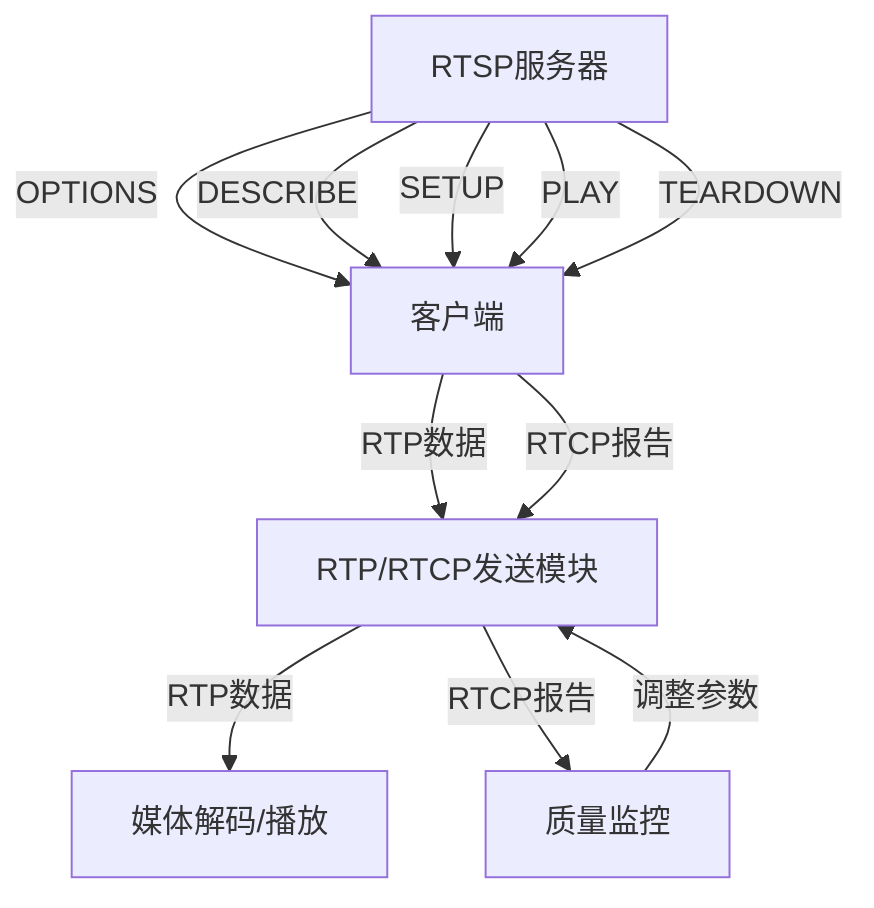

### 1. 概述
本文档为C++开发者整理RTP（Real-time Transport Protocol）、RTCP（Real-time Transport Control Protocol）和RTSP（Real Time Streaming Protocol）协议的核心知识，重点关注协议结构、数据包格式、实现要点和C++开发中的关键考虑。

---

### 2. RTP协议详解
#### 2.1. 基本概念
+ **RTP**（实时传输协议）：由IETF于1996年在RFC 1889中提出，用于IP网络上的实时多媒体数据传输（音频、视频等）
+ **工作方式**：运行在传输层之上，通常基于UDP协议
+ **核心功能**：
    - 提供端到端的实时传输服务
    - 通过时间戳和序列号确保数据同步和顺序
    - 支持多种媒体类型（音频、视频、文本）
    - 与RTCP配合使用，监控和优化传输质量

#### 2.2. RTP报文结构
RTP数据包头部（固定部分）：

| 字段 | 位数 | 说明 |
| --- | --- | --- |
| Ver | 2 | 协议版本，当前为2 |
| P | 1 | 填充位，1表示包尾有填充字节 |
| X | 1 | 扩展位，1表示有扩展头 |
| CC | 4 | CSRC计数，标识贡献源数量 |
| M | 1 | 标记位，用于特定应用 |
| PT | 7 | 负载类型，标识媒体格式和编码方式 |
| Sequence Number | 16 | 数据包序列号，用于检测丢失和重组 |
| Timestamp | 32 | 数据包第一个字节的采样时间 |
| SSRC | 32 | 同步源标识符，唯一标识RTP流源 |
| CSRC(n×32) | n×32 | 贡献源列表，标识数据来源 |


**关键字段说明**：

+ **Sequence Number**：用于接收端重组数据包和检测丢包
+ **Timestamp**：用于去除网络抖动和同步，与媒体采样率相关
+ **SSRC**：在RTP会话中必须唯一，通常随机生成
+ **PT (Payload Type)**：标识媒体格式，如PT=96表示H.264视频，时钟频率90kHz

#### 2.3. RTP实现要点（C++角度）
1. **序列号管理**：

```cpp
// C++中序列号的生成和递增
uint16_t sequence_number = rand() % 65536; // 初始随机值
// 发送新包时递增
sequence_number = (sequence_number + 1) & 0xFFFF;
```

2. **时间戳处理**：

```cpp
// 时间戳递增，与媒体采样率相关
uint32_t timestamp = 0; // 初始值
// 每个采样周期递增
timestamp += sample_rate / 1000; // 假设每毫秒一个采样点
```

3. **SSRC生成**：

```cpp
// 生成唯一SSRC
uint32_t generate_ssrc() {
    return `static_cast`<uint32_t>`(std::chrono::system_clock::now().time_since_epoch().count());
}
```

4. **多路复用**：
    - 在C++中，需要为不同媒体流（音频、视频）维护独立的RTP会话
    - 使用`std::map`或`std::unordered_map`管理SSRC与流的映射

---

### 3. RTCP协议详解
#### 3.1. 基本概念
+ **RTCP**（实时传输控制协议）：与RTP配合使用，提供服务质量反馈
+ **主要功能**：
    - 收集和报告媒体传输质量统计信息（丢包率、延迟、抖动等）
    - 为会话参与者提供规范的端点标识（CNAME）
    - 会话控制功能
    - 动态控制报告传输频率，避免网络拥塞

#### 3.2. RTCP报文结构
RTCP报文头部：

| 字段 | 位数 | 说明 |
| --- | --- | --- |
| Version | 2 | 协议版本，与RTP相同，为2 |
| Padding | 1 | 1表示包尾有填充字节 |
| Reception report count | 5 | 包含的接收报告块数量 |
| Packet type | 8 | RTCP包类型（SR、RR、SDES等） |
| Length | 16 | 包长度（以32位字为单位） |
| SSRC | 32 | 同步源标识符 |


**RTCP包类型**：

+ **SR (Sender Report)**：发送端报告，包含发送统计信息
+ **RR (Receiver Report)**：接收端报告，提供服务质量信息
+ **SDES (Source Description)**：源描述，包含CNAME等标识信息
+ **BYE**：结束流，宣布离开会议
+ **APP**：应用特定消息，用于扩展

#### 3.3. RTCP实现要点（C++角度）
1. **报告间隔控制**：

```cpp
// RTCP报告间隔控制，避免网络拥塞
const uint32_t kMinReportIntervalMs = 5000; // 最小5秒
uint64_t last_report_time = 0;

bool should_send_rtcp_report(uint64_t current_time) {
    return (current_time - last_report_time) >= kMinReportIntervalMs;
}
```

2. **CNAME生成**：

```cpp
// 生成CNAME，确保端点唯一标识
std::string generate_cname() {
    // 通常使用主机名+进程ID+时间戳
    return "user@hostname_" + std::to_string(getpid()) + "_" + std::to_string(time(nullptr));
}
```

3. **接收报告处理**：

```cpp
// 处理RR报告，计算丢包率和抖动
void process_rr_report(const RtcpRrPacket& rr) {
    uint32_t total_packets = rr.packet_count;
    uint32_t lost_packets = rr.lost_packets;
    float loss_rate = `static_cast`<float>`(lost_packets) / total_packets;
    
    // 计算抖动
    uint32_t jitter = calculate_jitter(rr);
    
    // 根据统计信息调整传输参数
    adjust_bitrate(loss_rate, jitter);
}
```

4. **RTCP带宽管理**：

```cpp
// RTCP带宽使用限制（不超过5%）
void adjust_rtcp_bandwidth(uint32_t total_bandwidth) {
    uint32_t rtcp_bandwidth = total_bandwidth * 0.05;
    // 确保至少25%给媒体源
    if (rtcp_bandwidth < total_bandwidth * 0.25) {
        rtcp_bandwidth = total_bandwidth * 0.25;
    }
}
```

---

### 4. RTSP协议详解
#### 4.1. 基本概念
+ **RTSP**（Real Time Streaming Protocol）：用于控制实时流媒体的传输
+ **工作方式**：客户端-服务器模型，使用TCP连接控制流媒体
+ **核心功能**：
    - 建立连接和会话
    - 获取媒体描述信息
    - 控制媒体流（播放、暂停、停止）
    - 管理会话状态

#### 4.2. RTSP常用方法
| 方法 | 作用 | 请求格式 | 响应格式 |
| --- | --- | --- | --- |
| OPTIONS | 获取服务器支持的方法 | `OPTIONS rtsp://server:port/session RTSP/1.0` | `RTSP/1.0 200 OK` |
| DESCRIBE | 获取媒体描述信息（SDP） | `DESCRIBE rtsp://server:port/session RTSP/1.0` | SDP格式数据 |
| SETUP | 建立连接，指定RTP/RTCP端口 | `SETUP rtsp://server:port/session/stream RTSP/1.0` | `Transport: RTP/AVP/TCP;unicast;interleaved=0-1` |
| PLAY | 开始播放媒体 | `PLAY rtsp://server:port/session RTSP/1.0` | `RTSP/1.0 200 OK` |
| TEARDOWN | 关闭连接 | `TEARDOWN rtsp://server:port/session RTSP/1.0` | `RTSP/1.0 200 OK` |


#### 4.3. SDP格式详解
SDP（Session Description Protocol）格式：

```plain
v=0
o=- 1867010921 1 IN IP4 192.168.0.170
s:Session streamed by "testH264VideoStreamer"
i: ch1
t:0 0
a:control:*
tool: AW RTSP Streaming v20170726
rtpmap:96 H264/90000
fmtp:97 streamtype=5;profile-level-id=1;mode=AAC-hbr;sizelength=13;indexlength=3;indexdeltalength=3
track0
m:video 0 RTP/AVP 96
c:IN IP4 0.0.0.0
b:AS:1048576
```

**关键字段说明**：

+ `v=0`：SDP版本
+ `o=`：会话标识（用户名、会话ID、版本、网络类型、地址类型、地址）
+ `s=`：会话标题
+ `i=`：会话描述
+ `t=`：时间描述（开始时间、结束时间）
+ `a=control:*`：会话控制属性
+ `rtpmap:96 H264/90000`：负载类型96对应H.264视频，时钟频率90kHz
+ `m=`：媒体描述（类型、端口、传输协议、负载类型）

#### 4.4. RTSP实现要点（C++角度）
1. **RTSP请求处理**：

```cpp
// RTSP请求解析
bool parse_rtsp_request(const std::string& request, RtspRequest& out) {
    // 解析方法、URL、版本
    std::istringstream iss(request);
    std::string method, url, version;
    iss >> method >> url >> version;
    
    // 解析CSeq
    std::string cseq_line;
    std::getline(iss, cseq_line);
    if (cseq_line.find("CSeq:") == 0) {
        out.cseq = std::stoi(cseq_line.substr(5));
    }
    
    out.method = method;
    out.url = url;
    return true;
}
```

2. **SDP解析**：

```cpp
// SDP解析
bool parse_sdp(const std::string& sdp, SdpDescription& out) {
    std::istringstream iss(sdp);
    std::string line;
    while (std::getline(iss, line)) {
        if (line.empty()) continue;
        
        char type = line[0];
        std::string value = line.substr(2);
        
        switch (type) {
            case 'v': out.version = value; break;
            case 'o': out.origin = value; break;
            case 's': out.session = value; break;
            case 'm': 
                // 解析媒体描述
                parse_media_description(value, out.media);
                break;
            // 处理其他字段...
        }
    }
    return true;
}
```

3. **RTP/RTCP端口分配**：

```cpp
// 处理SETUP请求，分配RTP/RTCP端口
void handle_setup_request(const RtspRequest& request, RtspResponse& response) {
    // 从请求中提取传输信息
    std::string transport = extract_transport(request);
    
    if (transport.find("RTP/AVP/TCP") != std::string::npos) {
        // TCP传输，使用interleaved通道
        response.transport = "RTP/AVP/TCP;unicast;interleaved=0-1";
    } else if (transport.find("RTP/AVP/UDP") != std::string::npos) {
        // UDP传输，指定端口
        uint16_t rtp_port = get_free_port();
        uint16_t rtcp_port = rtp_port + 1;
        response.transport = "RTP/AVP/UDP;unicast;client_port=" + 
                           std::to_string(rtp_port) + "-" + std::to_string(rtcp_port);
    }
}
```

---

### 5. RTP/RTCP与RTSP的协作关系
#### 5.1. 工作流程
1. **RTSP建立连接**：
    - 客户端发送`OPTIONS`获取服务器支持的方法
    - 发送`DESCRIBE`获取SDP描述
    - 发送`SETUP`建立连接，指定RTP/RTCP端口
2. **RTP/RTCP传输**：
    - 服务器通过SETUP中指定的端口开始发送RTP数据包
    - RTCP周期性发送报告（SR/RR/SDES）监控传输质量
3. **RTSP控制流**：
    - 客户端发送`PLAY`开始播放
    - 服务器开始发送RTP数据包
    - 客户端发送`TEARDOWN`结束会话

#### 5.2. C++实现架构


**C++实现要点**：

+ **RTSP服务器**：使用`libevent`或`Boost.Asio`实现TCP服务器
+ **RTP/RTCP模块**：实现RTP数据包发送/接收和RTCP报告处理
+ **媒体处理**：与解码器（如FFmpeg）集成，处理RTP数据包

---

### 6. 实际应用中的注意事项（C++开发者）
#### 6.1. 性能优化
1. **零拷贝设计**：
    - 避免在RTP数据包处理中进行不必要的内存复制
    - 使用`mmap`或`iovec`进行高效数据传输
2. **缓冲区管理**：

```cpp
// 使用环形缓冲区管理RTP数据包
class RtpBuffer {
public:
    void push(const RtpPacket& packet) {
        // 环形缓冲区实现
    }
    
    RtpPacket pop() {
        // 环形缓冲区实现
    }
private:
    ``std::`vector`<RtpPacket>` buffer_;
    size_t head_ = 0;
    size_t tail_ = 0;
};
```

3. **多线程处理**：
    - RTP数据接收线程
    - RTCP报告发送线程
    - RTSP控制处理线程

#### 6.2. 错误处理
1. **序列号检测**：

```cpp
// 检测RTP包丢失
void handle_rtp_packet(const RtpPacket& packet) {
    if (packet.sequence_number != next_expected_seq) {
        uint16_t lost_count = packet.sequence_number - next_expected_seq;
        log_loss(lost_count);
    }
    next_expected_seq = packet.sequence_number + 1;
}
```

2. **超时处理**：

```cpp
// RTCP报告超时处理
void check_rtcp_timeout() {
    if (time_since_last_rtcp > kRtcpTimeoutMs) {
        send_rtcp_report();
    }
}
```

3. **SDP错误处理**：

```cpp
// SDP解析错误处理
bool parse_sdp(const std::string& sdp) {
    // 解析SDP
    if (sdp.empty() || !is_valid_sdp(sdp)) {
        throw std::runtime_error("Invalid SDP format");
    }
    // ...
}
```

#### 6.3. 容性考虑
1. **RTP负载类型**：
    - 处理多种负载类型（PT=96 H.264, PT=110 H.265等）
    - 使用映射表动态解析负载类型
2. **不同传输协议**：
    - 支持RTP/UDP和RTP/TCP两种传输方式
    - 处理interleaved通道（TCP流中的RTP/RTCP交错传输）
3. **IPv4/IPv6支持**：
    - 确保网络地址处理兼容IPv4和IPv6

---

### 7. 总结
RTP/RTCP和RTSP是实时多媒体传输的核心协议，C++开发者在实现相关功能时需要关注：

1. **RTP**：关注时间戳、序列号处理，确保数据同步和顺序
2. **RTCP**：关注报告间隔控制、CNAME生成，实现质量监控
3. **RTSP**：关注请求/响应处理、SDP解析，实现流媒体控制
4. **协作**：理解RTSP如何与RTP/RTCP配合工作，构建完整的流媒体系统

**推荐学习资源**：

+ RFC 3551: RTP Profile for Audio and Video Conferences with Minimal Control
+ RFC 3550: RTP: A Transport Protocol for Real-Time Applications
+ RFC 2326: Real Time Streaming Protocol (RTSP)
+ DPDK文档（如需高性能网络处理）

通过深入理解这些协议，C++开发者可以构建高效、可靠的实时多媒体应用，如视频会议、直播平台、远程监控系统等。

